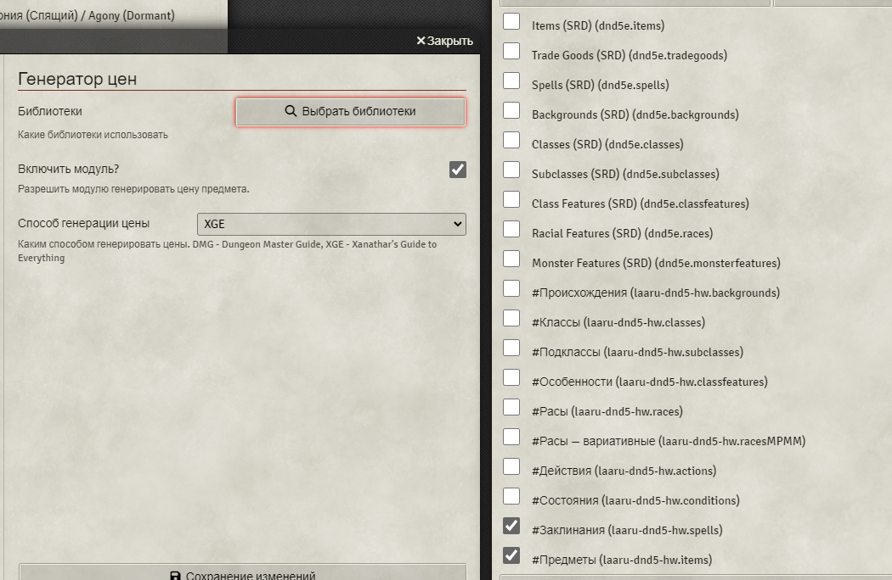

# 🎲 Модуль «Генератор Цены» для D&D 5e

## 📌 Описание

**«Генератор Цены»** — небольшой модуль, автоматически генерирующий цену предметов в зависимости от их редкости для системы **D&D 5e** (версия 4.3.1+).

При импорте предметов из библиотеки цена автоматически рассчитывается. Если предмет является расходником (например, боеприпасы, свитки заклинаний или зелья), то его базовая цена делится на два.

## ⚙️ Настройка и использование

1. **Метод генерации цен**  
   В настройках модуля можно выбрать желаемый метод генерации цен. В будущем планируется добавить возможность указания собственных формул и фиксированных значений.

2. **Выбор библиотек** *(важно!)*  
   Обязательно перейдите в раздел **«Выбрать библиотеки»** и отметьте те, к которым должны применяться новые цены.

## 🐞 Обратная связь

Если у вас есть предложения по улучшению или вы обнаружили ошибки, буду рад вашим замечаниям и рекомендациям. Пожалуйста, создавайте Issue на GitHub или свяжитесь со мной напрямую.

